# ML Course By Stanford University On Coursera
All the work done by me as a part of Coursera's Machine Learning Course + A Vectorized Python 🐍 implementation resembling **as closely as possible** to both provided and personally-completed code in the octave/matlab.
## What is this course about?
It's an excellent Stanford University Coursera course on machine learning and the maths behind. It is taught by [Andrew Ng](https://en.wikipedia.org/wiki/Andrew_Ng) a genius and an excellent popularizer, which is a rare combination. 

## 🐍 Python Implementation
Since the course uses Octave/Matlab in programming assignments, I reimplemented [all the assignments in Python]( https://github.com/hzitoun/coursera_machine_learning_course/tree/master/algorithms_in_python) using only NumPy, SciPy, and Matplotlib.

After that, I've converted each assignment to a [Jupyter Notebooks](https://github.com/hzitoun/coursera_machine_learning_matlab_python/tree/master/jupyter_notebooks).

## Algorithms:
1.  **Linear regression** with one variable to predict profits for a food truck 
- ▶️ [Notebook](https://github.com/hzitoun/coursera_machine_learning_matlab_python/blob/master/jupyter_notebooks/week_2/ex1.ipynb) 
- ▶️ [Matlab](https://github.com/hzitoun/coursera_machine_learning_matlab_python/tree/master/algorithms_in_matlab/week_2/ex1)

    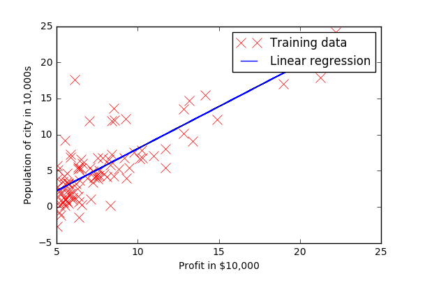

2.  **Regularized Multi features Linear regression** with multiple variables to predict the prices of houses 
- ▶️ [Notebook](https://github.com/hzitoun/coursera_machine_learning_matlab_python/blob/master/jupyter_notebooks/week_2/ex1MultiFeatures.ipynb)
- ▶️ [Matlab](https://github.com/hzitoun/coursera_machine_learning_matlab_python/blob/master/algorithms_in_matlab/week_2/ex1/ex1_multi.m)

    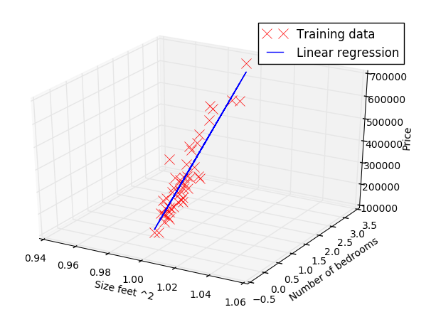

 
3.  **Regularized logistic regression** to predict whether microchips from a fabrication plant passes quality assurance (QA)
- ▶️ [Notebook](https://github.com/hzitoun/coursera_machine_learning_matlab_python/blob/master/jupyter_notebooks/week_3/ex2_reg.ipynb)
- ▶️ [Matlab](https://github.com/hzitoun/coursera_machine_learning_matlab_python/blob/master/algorithms_in_matlab/week_3/ex2/ex2_reg.m)

    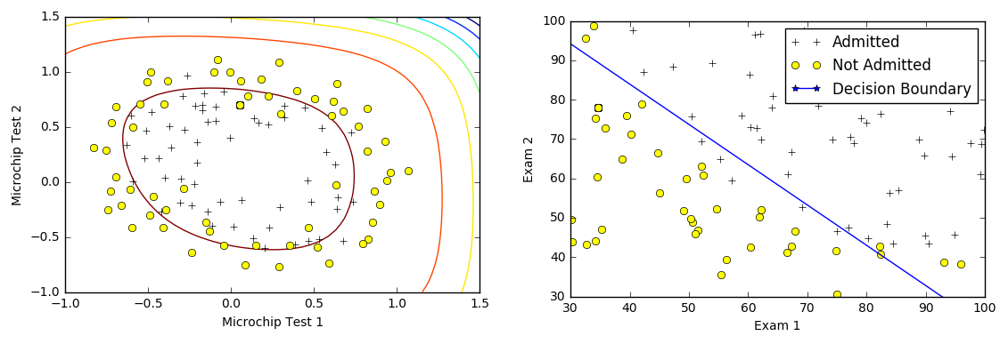

4.  **Multi-class Logistic regression** to recognize handwritten digits 
- ▶️ [Notebook](https://github.com/hzitoun/coursera_machine_learning_matlab_python/blob/master/jupyter_notebooks/week_4/ex3.ipynb)
- ▶️ [Matlab](https://github.com/hzitoun/coursera_machine_learning_matlab_python/blob/master/algorithms_in_matlab/week_4/ex3/ex3.m)

   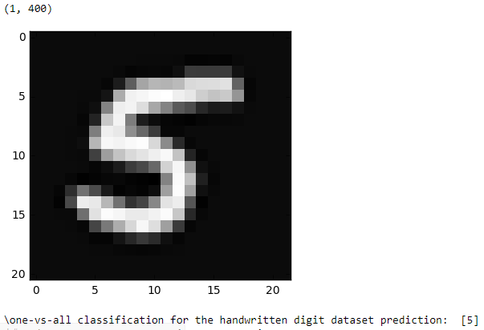

5.  **Neural Networks** to recognize handwritten digits 
- ▶️ [Notebook Part I](https://github.com/hzitoun/coursera_machine_learning_matlab_python/blob/master/jupyter_notebooks/week_4/ex3_nn.ipynb), [Notebook Part II](https://github.com/hzitoun/coursera_machine_learning_matlab_python/blob/master/jupyter_notebooks/week_5/ex4.ipynb)
- ▶️ [Matlab Part I](https://github.com/hzitoun/coursera_machine_learning_matlab_python/blob/master/algorithms_in_matlab/week_4/ex3/ex3_nn.m), [Matlab Part II](https://github.com/hzitoun/coursera_machine_learning_matlab_python/blob/master/algorithms_in_matlab/week_5/ex4/ex4_nn.m)

    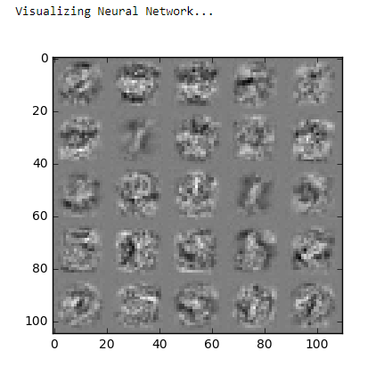

6.  **Metrics To Evaluate Machine Learning Algorithms - High Bias v.s. High Variance (Overfitting vs Underfitting)**
- ▶️ [Notebook](https://github.com/hzitoun/coursera_machine_learning_matlab_python/blob/master/jupyter_notebooks/week_6/ex5.ipynb)
- ▶️ [Matlab](https://github.com/hzitoun/coursera_machine_learning_matlab_python/blob/master/algorithms_in_matlab/week_6/ex5/ex5.m)

    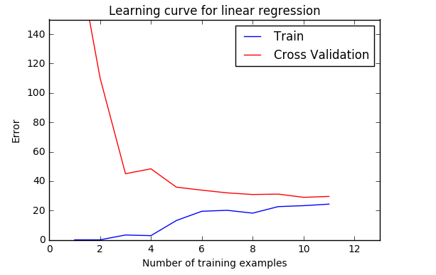

7.  **Support vector machines SVM** ( with and without Gaussian Kernels) to classify email (spam or not spam)
- ▶️ [Intro Notebook](https://github.com/hzitoun/coursera_machine_learning_matlab_python/blob/master/jupyter_notebooks/week_7/ex6.ipynb)
- ▶️ [Matlab](https://github.com/hzitoun/coursera_machine_learning_matlab_python/blob/master/algorithms_in_matlab/week_7/ex6/ex6.m)

    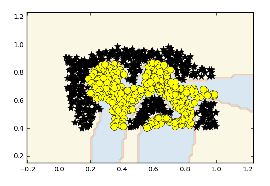
    
- ▶️ [SVM for Spam Notebook](https://github.com/hzitoun/coursera_machine_learning_matlab_python/blob/master/jupyter_notebooks/week_7/ex6_spam.ipynb)
- ▶️ [SVM for Spam Matlab](https://github.com/hzitoun/coursera_machine_learning_matlab_python/blob/master/algorithms_in_matlab/week_7/ex6/ex6_spam.m)

    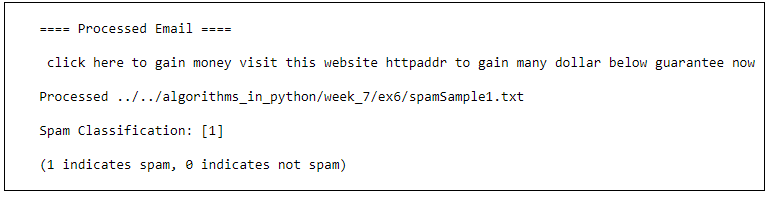

8.  **K-means** clustering algorithm for image compression

   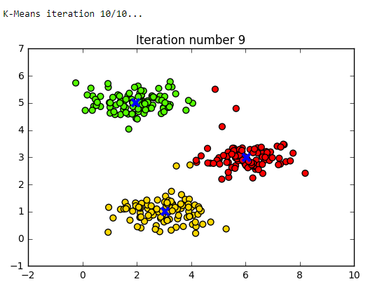
    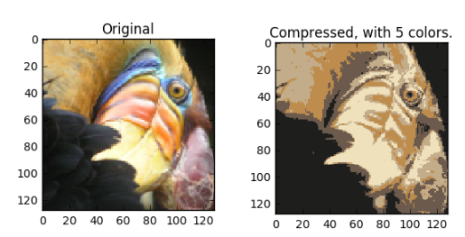

9.  **Principal component analysis (PCA)** to perform dimensionality reduction

 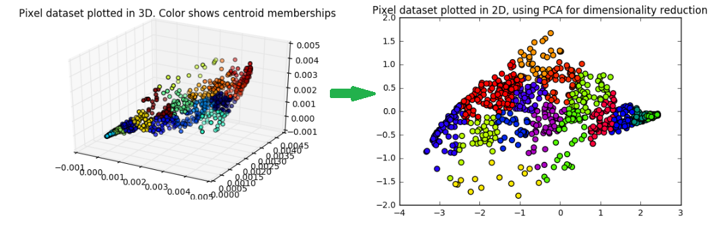

   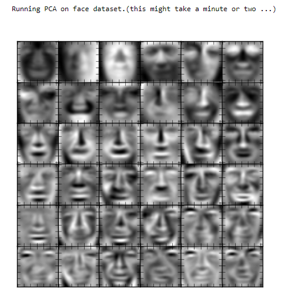

 
10.  **Anomaly detection algorithm** to detect anomalous behavior in server computers of a data center

    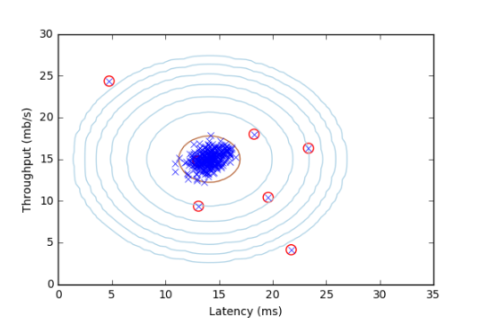

11. **Collaborative filtering recommender system** applied to a dataset of movie ratings

    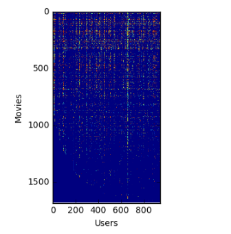

## Matlab Implementation
Assignments in Matlab
https://github.com/hzitoun/coursera_machine_learning_course/tree/master/algorithms_in_matlab
