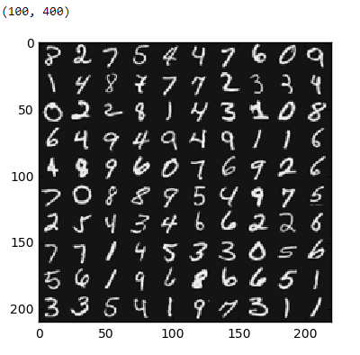

# ML Course By Stanford University On Coursera
All the work done by me as a part of Coursera's Machine Learning Course + A Vectorized Python 🐍 implementation resembling as closely as possible to both provided and personally-completed code in the octave/matlab.
## What is this course about?
It's an excellent Stanford University Coursera course from the leaders of AI. It is taught by [Andrew Ng](https://en.wikipedia.org/wiki/Andrew_Ng) a genius and an excellent popularizer, which is a rare combination. 
## Algorithms:
1.  **Linear regression** with one variable to predict profits for a food truck

2.  **Regularized Linear regression** with multiple variables to predict the prices of houses

3.  **Regularized logistic regression** to predict whether microchips from a fabrication plant passes quality assurance (QA)

    
    

4.  **Multi-class Logistic regression** to recognize handwritten digits 

    
    

5.  **Neural Networks** to recognize handwritten digits 

    
    

6.  **Support vector machines SVM** ( with and without Gaussian Kernels) to classify email (spam or not spam)

    
    

7.  **K-means** clustering algorithm for image compression

    
    

8.  **Principal component analysis (PCA)** to perform dimensionality reduction

    

     

 
9.  **Anomaly detection algorithm** to detect anomalous behavior in server computers of a data center

     

10. **Collaborative filtering recommender system** applied to a dataset of movie ratings

     

## 🐍 Python Implementation
Since the course uses Octave/Matlab in programming assignments, I wanted to reimplement each assignment in Python using only NumPy, SciPy, and Matplotlib
https://github.com/hzitoun/coursera_machine_learning_course/tree/master/algorithms_in_python
## Matlab Implementation
Assignments in Matlab
https://github.com/hzitoun/coursera_machine_learning_course/tree/master/algorithms_in_matlab
